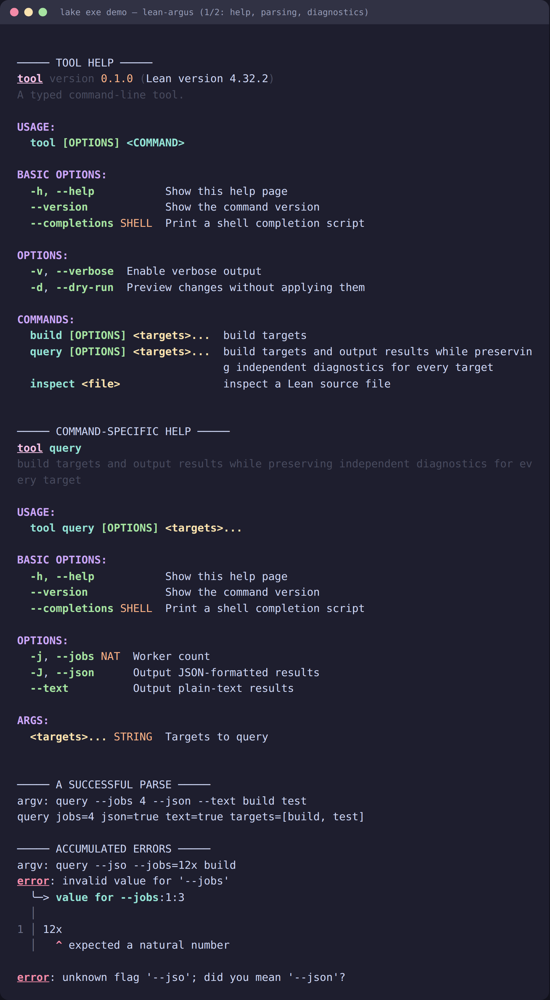

# lean-argus

[](https://github.com/jonaprieto/lean-argus/actions/workflows/ci.yml)
[](https://github.com/jonaprieto/lean-argus/releases)
[](lean-toolchain)
[](https://jonaprieto.github.io/lean-argus/)
[](LICENSE)

Typed command-line parsing for Lean 4. Flag values are [Grip grammars](https://github.com/jonaprieto/lean-grip); help text and shell
completions are derived from the same command specification.

<p align="center"></p>

## Status and review

These libraries are actively evolving and are developed with AI assistance and human review.
CI and machine-checked proofs provide useful evidence, but do not guarantee correctness,
soundness, portability, performance, or suitability for every use case. Validate behavior
and assumptions before relying on a release.

Reviewer feedback is welcome, especially on correctness, proofs, API design, usability,
portability, performance, documentation, and real-world use. Please use the
[issue tracker](https://github.com/jonaprieto/lean-argus/issues) or open a PR with a
reproducible example and the expected behavior.

## Quick start

```lean
import Argus
import Argus.Term
open Argus

argus_opts Opts where
  ignoreCase : Bool        := Spec.switch "ignore-case" (some 'i') "Ignore case";
  jobs       : Nat         := Spec.flag "jobs" (some 'j') "Worker threads" Param.nat;
  timeout    : Nat         := Spec.flag "timeout" none "Give up after" Param.duration;
  files      : List String := Spec.many (Spec.arg "FILE" "Files to search" Param.path)

def grepish := Argus.cmd "grepish" Opts.spec (version := some "0.1.0")

def main (argv : List String) : IO UInt32 :=
  Argus.Term.main grepish argv fun o => do
    IO.println s!"{o.jobs} workers, {o.timeout}s budget, {o.files.length} files"
    return 0
```

`Argus.Term.main` handles `--help`, `--version`, completions, terminal width, `NO_COLOR`, and
exit codes. `Argus.Completions` remains pure; `Argus.Help` renders styled help; `Argus.Term` is
the opt-in terminal layer.

## Features

- leaf and nested subcommands;
- typed flags, arguments, repetitions, enums, ranges, durations, bytes, and CSV values;
- accumulated usage errors with source locations inside flag values;
- bash, zsh, and fish completions;
- separate `Argus.Properties` laws and executable tests.

## Build

```sh
lake build Argus Argus.Term Argus.Properties demo tests readme
lake exe demo
lake exe tests
```

## Related projects

Built on [`grip`](https://github.com/jonaprieto/lean-grip),
[`termcolor`](https://github.com/jonaprieto/lean-termcolor),
[`termcolor-layout`](https://github.com/jonaprieto/lean-termcolor-layout),
[`termcolor-diagnostics`](https://github.com/jonaprieto/lean-termcolor-diagnostics), and
[`termcolor-terminal`](https://github.com/jonaprieto/lean-termcolor-terminal). It is used by
[`eventb-lean`](https://github.com/jonaprieto/eventb-lean),
[`lean-calc-chat`](https://github.com/jonaprieto/lean-calc-chat),
[`termcolor-repl`](https://github.com/jonaprieto/lean-termcolor-repl), and
[`oatp`](https://github.com/jonaprieto/oatp).

## License

Apache-2.0.
