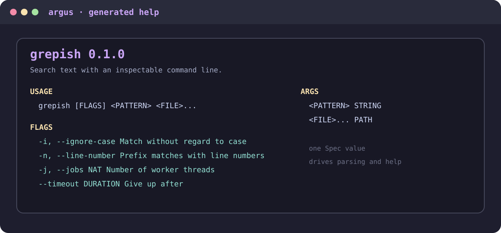
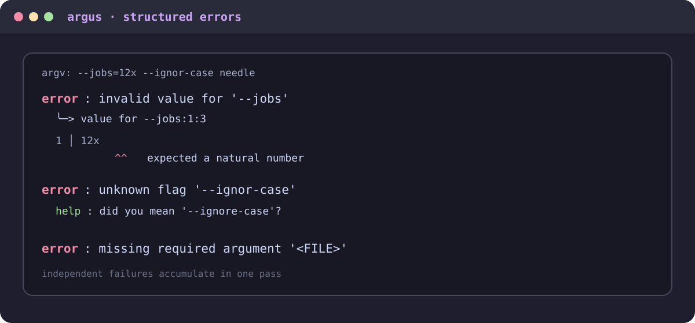
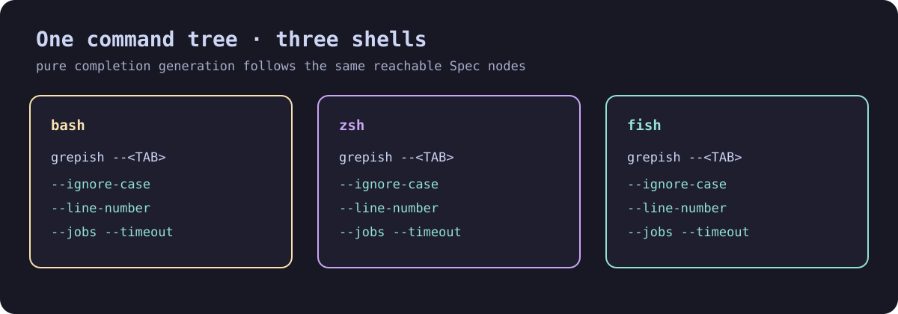

# argus

[](lean-toolchain)
[](LICENSE)

A command-line library for Lean 4. Flag values are grammars, not strings; help text and
shell completions are derived from the same value the parser runs on, so they cannot
disagree with it.

## Layers

One repo, one `require`, layered `lean_lib` targets. Import only what you need.

```
                              Argus (namespace)
                                    |
   +-----------+-----------+--------+-------+-----------+-------------+
   |           |           |                |           |             |
Argus.Spec  Argus.Param  Argus.Runner  Argus.Command  Argus.Help  Argus.Completions
(graded,    (grip value  (argv ->      (leaf or       (termcolor  (pure walk,
 inspect-    grammars)    tokens ->     branch of      + -layout)   bash/zsh/fish,
 able)                    typed)        subcommands)                no color)
   |           |           |                |           |             |
   +-----------+-----------+----------------+           |             |
               |                                        |             |
        grip                                        termcolor,      (Spec only)
   Grade / Modality + GParser                  termcolor-layout

Argus.Macro       argus_opts: structure + Spec in one declaration (macro, no Lean.Elab)
Argus.Term        opt-in IO layer: real terminal width, NO_COLOR (+ termcolor-terminal)
Argus.Properties  machine-checked laws, separate target so consumers do not link proofs
```

`Argus.Completions` depends on the spec alone — no color, no IO. `Argus.Help` uses
[`termcolor`](https://github.com/jonaprieto/lean-termcolor),
[`termcolor-layout`](https://github.com/jonaprieto/lean-termcolor-layout), and
[`termcolor-diagnostics`](https://github.com/jonaprieto/lean-termcolor-diagnostics), while
`Argus.Term` adds terminal sizing and output through
[`termcolor-terminal`](https://github.com/jonaprieto/lean-termcolor-terminal).

Help uses the semantic `ColorScheme.catppuccin` palette by default; pass another
`ColorScheme` as the final argument to `Help.render`, `Help.renderTo`, or `Term.main` when an
application wants a different palette.

## Package chain

These packages form one focused stack:

[`termcolor`](https://github.com/jonaprieto/lean-termcolor) →
[`termcolor-layout`](https://github.com/jonaprieto/lean-termcolor-layout) →
[`termcolor-diagnostics`](https://github.com/jonaprieto/lean-termcolor-diagnostics) →
[`termcolor-widgets`](https://github.com/jonaprieto/lean-termcolor-widgets) →
[`termcolor-terminal`](https://github.com/jonaprieto/lean-termcolor-terminal)

Argus sits above it: [`grip`](https://github.com/jonaprieto/grip) supplies value grammars,
`Argus.Help` uses layout, and `Argus.Term` connects parsed commands to terminal output.
Each package keeps its machine-checked properties in a separate build target.

## Visual gallery

The demo gallery shows the same command specification producing help, accumulated diagnostics,
and shell completions:







## Quick start

`argus_opts` declares the structure and its spec in one place, so field order and parse
order cannot drift apart.

```lean
import Argus
import Argus.Term
open Argus

argus_opts Opts where
  ignoreCase : Bool        := Spec.switch "ignore-case" (some 'i') "Ignore case";
  jobs       : Nat         := Spec.flag "jobs" (some 'j') "Worker threads" Param.nat;
  timeout    : Nat         := Spec.flag "timeout" none "Give up after" Param.duration;
  files      : List String := Spec.many (Spec.arg "FILE" "Files to search" Param.path)

def grepish := Argus.cmd "grepish" Opts.spec (version := some "0.1.0")

def main (argv : List String) : IO UInt32 :=
  Argus.Term.main grepish argv fun o => do
    IO.println s!"{o.jobs} workers, {o.timeout}s budget, {o.files.length} files"
    return 0
```

`Term.main` is the whole entry point: it answers `--help`, `--version`, and
`--completions SHELL` before parsing, prints errors to stderr at the real terminal width,
respects `NO_COLOR`, and exits `2` on a usage error.

No grade is ever written by hand. Building the spec with the combinators directly works
too, if you would rather not use the macro; the explicit form uses the existing `<*>`
operator. `Spec` is applicative rather than monadic, so `do` notation is not the right tool
for assembling a spec.

## Subcommands

A command is either a leaf holding a spec or a branch holding children. All children share
one result type, so the application supplies its own sum.

```lean
inductive Act where
  | build (release : Bool)
  | test  (filter : String)

def tool := Argus.group "tool"
  [ Argus.cmd "build" (Spec.map Act.build (Spec.switch "release" (some 'r') "Optimised"))
      (description := "Build the project")
  , Argus.cmd "test"  (Spec.map Act.test (Spec.arg "FILTER" "Name filter" Param.str))
      (description := "Run the tests") ]
  (version := some "0.1.0")
```

Nesting works to any depth. `tool buld` suggests `build`; `tool build --help` documents
`build`, not `tool`.

## Value grammars

`Param` carries a grip parser, so a flag value can be a real grammar rather than a string
someone later hopes to interpret.

| `Param` | accepts | yields |
|---|---|---|
| `str`, `path` | anything | `String` |
| `nat`, `int` | `42`, `-42`, `+42` | `Nat`, `Int` |
| `bool` | `true`/`yes`/`on`/`1` and negations, any case | `Bool` |
| `duration` | `2h30m`, `1d`, `90s`, `90` | seconds |
| `bytes` | `512`, `1k`, `1.5M`, `2GiB`, `10MB` | bytes |
| `range` | `10..20`, rejecting `20..10` | `Nat × Nat` |
| `csv p` | `a,b,c`, rejecting an empty element | `List α` |
| `enum [..]` | exact names, listing them on failure | `α` |

## What it does differently

**Flag values are grammars, and errors point inside them.** `Param` carries a
[grip](https://github.com/jonaprieto/grip) parser over the value's bytes, so `--timeout`
takes a duration rather than a string something later hopes to interpret.

**Errors accumulate and point into bad values.** `ap` has no data dependency between its
sides, so both run and every independent failure is reported in one pass. Real output from the
example above:

```
$ grepish --jobs=12x --timout=1h a.txt
error: invalid value for '--jobs'
  --> value for --jobs:1:3
   |
1 | 12x
  |   ^ expected a natural number

error: missing required flag '--timeout'
error: unknown flag '--timout=1h'; did you mean '--timeout'?
```

**A zero-width `many` is a type error.** `Spec.many` requires its element to have
`consumes = always`, mirroring `GParser.many`. In Parsec this is a runtime error; here the
elaborator rejects it:

```
error: Application type mismatch: The argument (Spec.arg "FILE" "input" Param.str).opt
  has type     Spec (conditional.choice 1) (Option String)
  but is expected to have type
               Spec { errors := ?m, consumes := always } ?m
```

**Help is derived, not written.** It reads `Spec.toMeta`, a projection of the same value
the runner interprets, so it cannot describe a flag the parser rejects. Alignment uses
display-cell width, not `String.length`, so CJK and emoji still line up.

```
$ grepish --help
grepish 0.1.0

USAGE
  grepish [FLAGS] <FILE>...

GLOBAL OPTIONS
-h, --help           Show this help page
--version            Show the command version
--completions SHELL  Print a shell completion script

FLAGS
-i, --ignore-case    Ignore case
-j, --jobs NAT       Worker threads
--timeout DURATION   Give up after

ARGS
<FILE>... PATH  Files to search
```

## Completions

Pure `Command → String` for bash, zsh, and fish. Each node of a command tree gets its own
arm, so the script offers what is reachable from where you are:

```
tool <TAB>            -> build test inner
tool build <TAB>      -> --release -r        (only its own)
tool test <TAB>       -> --jobs -j           (build's do not leak in)
tool inner <TAB>      -> leaf
tool inner leaf <TAB> -> filenames           (its argument is PATH-typed)
```

Flag names pass through `isSafeName` before interpolation, so a name carrying `$` or a
backtick yields a smaller script rather than one that executes when sourced;
`Completions.validate` reports what was dropped.

CI sources the generated script and drives `COMP_WORDS` at each depth, because asserting
on the script's text cannot tell you whether a shell offers the right words. All three
scripts are parsed by their own shell.

```sh
$ grepish --completions bash > /etc/bash_completion.d/grepish
```

## Proofs

`Argus.Properties` is a separate build target, so consumers never link proofs.

`reachableFlagNames_eq` is a structural induction over all eight `Spec` constructors
showing that the metadata projection agrees with structural flag reachability — the reason
help and completions cannot describe a flag the parser rejects. The grade identities are
general. `#print axioms` reports only `propext`, `Classical.choice`, and `Quot.sound`: no
`sorry`, no `axiom`, no `native_decide`.

`help_sound` and `completion_sound` are **not** theorems. Their implementations bottom out
in opaque string-search primitives, so proving them in the kernel needs a theorem layer
that does not exist yet. They are executable tests, and the module docstring says so.

## Build

```sh
lake build                    # the pure library
lake build Argus.Term         # opt-in IO layer (+ termcolor-terminal)
lake build Argus.Properties   # the proofs
lake exe tests                # the assertion suite, no framework
lake exe demo                 # one Command value -> help, parses, completion scripts
python3 scripts/style-check.py
```

## License

Apache-2.0.
